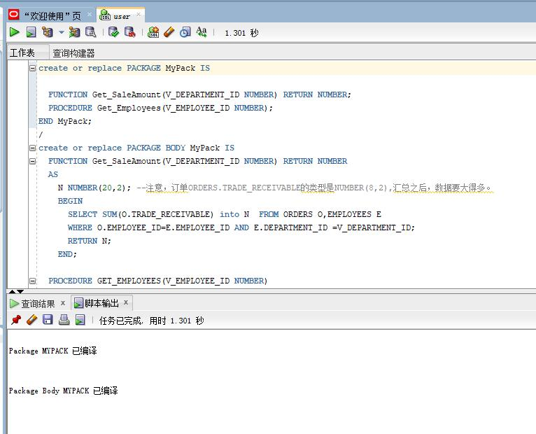
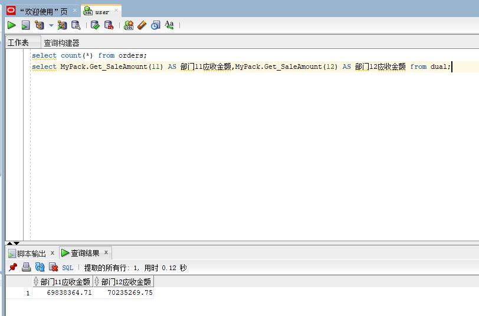
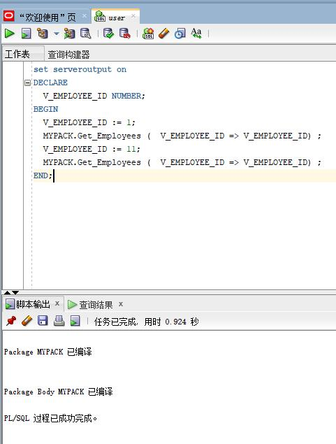

# 作业5

姓名：陈智明

学号：201810414108

班级：软件工程1班

### 实验目的

```
了解PL/SQL语言结构
了解PL/SQL变量和常量的声明和使用方法
学习条件语句的使用方法
学习分支语句的使用方法
学习循环语句的使用方法
学习常用的PL/SQL函数
学习包，过程，函数的用法。
```

### 实验场景

- 假设有一个生产某个产品的单位，单位接受网上订单进行产品的销售。通过实验模拟这个单位的部分信息：员工表，部门表，订单表，订单详单表。
- 本实验以实验四为基础

### 实验内容

1. 创建一个包(Package)，包名是MyPack。

2. 在MyPack中创建一个函数SaleAmount ，查询部门表，统计每个部门的销售总金额，每个部门的销售额是由该部门的员工(ORDERS.EMPLOYEE_ID)完成的销售额之和。函数SaleAmount要求输入的参数是部门号，输出部门的销售金额。

3. 在MyPack中创建一个过程，在过程中使用游标，递归查询某个员工及其所有下属，子下属员工。过程的输入参数是员工号，输出员工的ID,姓名，销售总金额。信息用dbms_output包中的put或者put_line函数。输出的员工信息用左添加空格的多少表示员工的层次（LEVEL）。比如下面显示5个员工的信息：

4. 由于订单只是按日期分区的，上述统计是全表搜索，因此统计速度会比较慢，如何提高统计的速度呢？

   ```
    ID 姓名 销售总金额
    =======================
    2  张三  5000元
    3 李四   6000元
    4 王五   1000元
        5 孙强  2000元
    6  赵强东 5000 元
   ```

上述输出结果表示 2，6号两个员工是一个级别的，没有领导，3，4号员工的领导是2号，5号员工的领导是4号。 Oracle递归查询的语句格式是：

```
​```sql
SELECT LEVEL,EMPLOYEE_ID,NAME,MANAGER_ID FROM employees 
START WITH EMPLOYEE_ID = V_EMPLOYEE_ID 
CONNECT BY PRIOR EMPLOYEE_ID = MANAGER_ID
​```
```

```sql
create or replace PACKAGE MyPack IS

  FUNCTION Get_SaleAmount(V_DEPARTMENT_ID NUMBER) RETURN NUMBER;
  PROCEDURE Get_Employees(V_EMPLOYEE_ID NUMBER);
END MyPack;
/
create or replace PACKAGE BODY MyPack IS
  FUNCTION Get_SaleAmount(V_DEPARTMENT_ID NUMBER) RETURN NUMBER
  AS
    N NUMBER(20,2); --注意，订单ORDERS.TRADE_RECEIVABLE的类型是NUMBER(8,2),汇总之后，数据要大得多。
    BEGIN
      SELECT SUM(O.TRADE_RECEIVABLE) into N  FROM ORDERS O,EMPLOYEES E
      WHERE O.EMPLOYEE_ID=E.EMPLOYEE_ID AND E.DEPARTMENT_ID =V_DEPARTMENT_ID;
      RETURN N;
    END;

  PROCEDURE GET_EMPLOYEES(V_EMPLOYEE_ID NUMBER)
  AS
    LEFTSPACE VARCHAR(2000);
    begin
      --通过LEVEL判断递归的级别
      LEFTSPACE:=' ';
      --使用游标
      for v in
      (SELECT LEVEL,EMPLOYEE_ID,NAME,MANAGER_ID FROM employees
      START WITH EMPLOYEE_ID = V_EMPLOYEE_ID
      CONNECT BY PRIOR EMPLOYEE_ID = MANAGER_ID)
      LOOP
        DBMS_OUTPUT.PUT_LINE(LPAD(LEFTSPACE,(V.LEVEL-1)*4,' ')||
                             V.EMPLOYEE_ID||' '||v.NAME);
      END LOOP;
    END;
END MyPack;
```



##### 函数Get_SaleAmount()测试方法：

```sql
select count(*) from orders;
select MyPack.Get_SaleAmount(11) AS 部门11应收金额,MyPack.Get_SaleAmount(12) AS 部门12应收金额 from dual;
```



##### 过程Get_Employees()测试代码：

```sql
set serveroutput on
DECLARE
  V_EMPLOYEE_ID NUMBER;    
BEGIN
  V_EMPLOYEE_ID := 1;
  MYPACK.Get_Employees (  V_EMPLOYEE_ID => V_EMPLOYEE_ID) ;  
  V_EMPLOYEE_ID := 11;
  MYPACK.Get_Employees (  V_EMPLOYEE_ID => V_EMPLOYEE_ID) ;    
END;
```




### 实验总结

PL/SQL的优点或特征
1、有利于客户/服务器环境应用的运行
对于客户/服务器环境来说，真正的瓶颈是网络上。无论网络多快，只要客户端与服务器进行大量的数据交换。应用运行的效率自然就回受到影响。如果使用PL/SQL进行编程，将这种具有大量数据处理的应用放在服务器端来执行。自然就省去了数据在网上的传输时间。
2、 适合于客户环境
PL/SQL由于分为数据库PL/SQL部分和工具PL/SQL。对于客户端来说，PL/SQL可以嵌套到相应的工具中，客户端程序可以执行本地包含PL/SQL部分，也可以向服务发SQL命令或激活服务器端的PL/SQL程序运行。
3、过程化
PL/SQL是Oracle在标准SQL上的过程性扩展，不仅允许在PL/SQL程序内嵌入SQL语句，而且允许使用各种类型的条件分支语句和循环语句，可以多个应用程序之间共享其解决方案。
4、模块化
PL/SQL程序结构是一种描述性很强、界限分明的块结构、嵌套块结构，被分成单独的过程、函数、触发器，且可以把它们组合为程序包，提高程序的模块化能力。
5、 运行错误的可处理性
使用PL/SQL提供的异常处理（EXCEPTION），开发人员可集中处理各种ORACLE错误和PL/SQL错误，或处理系统错误与自定义错误，以增强应用程序的健壮性。
6、提供大量内置程序包
ORACLE提供了大量的内置程序包。通过这些程序包能够实现DBS的一些低层操作、高级功能，不论对DBA还是应用开发人员都具有重要作用。
7、更好的性能、可移植性和兼容性、可维护性、易用性与快速性等。

