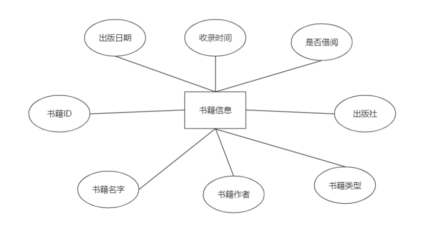

# 实验6（期末考核） 基于Oracle的图书管理系统数据设计数据库设计

## 一、需求分析

### 1.背景分析

随着图书馆规模的不断扩大，图书数量也相应的增加，有关图书的各种信息量也成倍增加，面对着庞大的信息量，传统的人工方式管理会导致图书馆管理上的混乱，人力与物力过多浪费，图书馆管理费用的增加，从而使图书馆的负担过重，影响整个图书馆的运作和控制管理，因此，必须制定一套合理、有效，规范和实用的图书管理系统，对图书资料进行集中统一的管理。

另一方面，IT产业和Internet获得了飞速发展，计算机应用已渗透到了各个领域，引起信息管理的革命，实现了信息的自动化处理，提高了处理的及时性和正确性。 提高图书管理工作效率，作到信息的规范管理，科学统计和快速查询，让图书馆更好的为学校，社会服务。

### 2. 数据结构需求分析

图书馆管理信息系统需要完成功能主要有：

(1) 读者基本信息的输入，包括借书证编号、读者姓名、读者性别。

(2) 读者基本信息的查询、修改，包括读者借书证编号、读者姓名、读者性别等。

(3) 书籍类别标准的制定、类别信息的输入，包括类别编号、类别名称。

(4) 书籍类别信息的查询、修改，包括类别编号、类别名称。

(5) 书籍库存信息的输入，包括书籍编号、书籍名称、书籍类别、作者姓名、出版社名称、出版日期、登记日期。

(6) 书籍库存信息的查询，修改，包括书籍编号、书籍名称、书籍类别、作者姓名、出版社名称、出版日期登记日期等。

(7) 借书信息的输入，包括读者借书证编号、书籍编号、借书日期。

(8) 借书信息的查询、修改，包括借书证编号、读者编号、读者姓名、书籍编号、书籍名称、借书日期等。

(9) 还书信息的输入，包括借书证编号、书籍编号、还书日期。

(10) 还书信息的查询和修改，包括还书读者借书证编号、读者姓名、书籍编号、书籍名称、借书日期、还书日期等。

(11) 超期还书罚款输入，还书超出期限包括超出期限还书的读者借书证号，书籍编号，罚款金额。

(12) 超期还书罚款查询，删除，包括读者借书证编号、读者姓名、书籍编号、书籍名称，罚款金额等

### 3. 事务处理需求分析

(1)在读者信息管理部分,要求: a.可以查询读者信息。 b.可以对读者信息进行添加及删除的操作。

(2 )在书籍信息管理部分,要求: a.可以浏览书籍信息,要求: b.可以对书籍信息进行维护,包括添加及删除的操作。

(3)在借阅信息管理部分,要求:a.可以浏览借阅信息。 b.可以对借阅信息进行维护操作。

(4)在归还信息管理部分，要求: a.可以浏览归还信息 b.对归还信息可修改维护操作

(5)在管理者信息管理部分,要求: a.显示当前数据库中管理者情况。 b.对管理者信息维护操作。 (6)在罚款信息管理部分,要求: a.可以浏览罚款信息 b.对罚款信息可以更新

### 4. 关系模式

(1) 书籍类别（种类编号，种类名称）

(2) 读者（借书证编号，读者姓名，读者性别，读者种类，登记时期）

(3) 书籍（书籍编号，书籍名称，书籍类别，书记作者，出版社名称，出版日期，登记日期） (4) 借阅（借书证编号，书籍编号，读者借书时间）

(5) 还书（借书证编号，书籍编号，读者还书时间）

(6) 罚款（借书证编号，读者姓名，借书证编号，书籍编号，读者借书时间） 以上通过关系代数方法的进行运算得到所需要的结果，在实验结果中可以看到。

## 二、方案图表设计

根据所要实现的功能设计，可能建立它们之间的关系，进而实现逻辑结构功能。

图书管理信息系统可以划分的实体有：书籍类别信息实体、读者信息实体、书籍信息实体、借阅记录信息实体，归还记录信息实体。用E-R图一一描述这些实体。

总体E-R图:

 


总体ER图

### 1. 图书类别实体E-R图


图书类别实体ER图

### 2. 读者信息实体E-R图


读者信息ER图

### 3. 书籍信息实体E-R图



书籍信息实体ER图

### 4. 借阅记录信息实体E-R图


借阅信息实体ER图

### 5. 归还记录信息实体E-R图


归还信息实体ER图

### 6. 罚款信息实体E-R图


罚款信息实体E-R图

### 7. 总的信息实体E-R图


总的信息实体E-R图

### 8. 数据字典


book_sytle 书籍类别信息表


system_readers读者信息表格


system_book书籍信息表


borrow_record 借阅记录信息表


return_record 借阅记录信息表


reader_fee 罚款记录信息表

## 三、数据库各表实现

### 1. 创建表空间与用户赋权

```sql
create temporary tablespace TSGL_ TEMP
tempfile '/optTSGL/TSGL_ _TEMP.dbf'
size 50m
autoextend on
next 50m maxsize 204 80m
extent management local;
create tablespace TSGL_ DATA
logging
datafile '/opt/TSGL/TSGL_ DATA .dbf'
size 50m
autoextend on
next 50m maxsize 204 80m
extent management local;
create user TSGL identified by 123456
default tablespace TSGL_ DATA
temporary tablespace TSGL_ TEMP ;
grant connect,resource,dba to TSGL;
```

### 2. 书本类别表建立

```sql
create table book_ style
(
bookstyleno varchar(30) primary key,
bookstyle varchar(30)
);
```

### 3. 创建书库表

```sql
create table system_ books
(
bookid varchar(20) primary key,
bookname varchar(30) Not null,
bookstyleno varchar(30) Not null,
bookauthor varchar(30),
bookpub varchar(30)，
bookpubdate datetime,
bookindate datetime，
isborrowed varchar (2)，
foreign key (bookstyleno) references book_ style (bookstyleno)
);

```

### 4. 借书证表建立

```sql
create table system_ readers
( readerid varchar(9)primary key,
readername varchar(9)not null，
readersex varchar(2) not null,
readertype varchar(10), 
regdate datetime
);
```

### 5. 借书记录表建立

```sql
create table borrow_ record
( bookid varchar(20) primary key,
readerid varchar(9),
borrowdate datetime,
foreign key (bookid) references system_ books(bookid),
foreign key (readerid) references system_ readers(readerid)
);
```

### 6. 还书记录表建立

```sql
create table return_ record
( bookid varchar(20) primary key,
readerid varchar(9),
returndate datetime,
foreign key (bookid) references system_ books(bookid),
foreign key (readerid) references system_ readers(readerid)
);
```

### 7. 罚款单表建立

```sql
create table reader_ fee
( readerid varchar(9)not null,
readername varchar(9)not null，
bookid varchar(20) primary key,
bookname varchar(30) Not null, 
bookfee varchar(30)，
borrowdate datetime,
foreign key (bookid) references system_ books(bookid),
foreign key (readerid) references system_ readers(readerid)
);
```

## 四、数据库实施

### 1. 将书籍类别加入表book_style中

```sql
declare
begin
    for i in 2..5000
loop
INSERT INTO "TSGL"."BOOK STYLE" VALUES ('1', '人文艺术类);
INSERT INTO "'TSGL"."'BOOK STYLE" VALUES ('2','自然科学类);
INSERT INTO "TSGL"."BOOK STYLE" VALUES ('3', '社会科学类);
INSERT INTO "TSGL"."BOOK_ STYLE"' VALUES ('4','图片艺术类);
INSERT INTO "TSGL"."BOOK STYLE" VALUES ('5', '政治经济类);
INSERT INTO "TSGL"."'BOOK_ STYLE" VALUES ('6','工程技术类);
INSERT INTO "TSGL"."BOOK_ STYLE" VALUES ('7','语言技能类);
    end loop;
end;
```

### 2. 将已有的图书加入system_books表中

```sql
declare
begin
    for i in 2..5000
loop
INSERT NTO "TSGL"."'SYSTEM_ BOOKS" VALUES ('00125415153', '计算机组成
原理'，'6'，'王爱英'，'清华大学出版社'，TO_ DATE('2001-01-03 00:00:00',
'YYYY-MM-DD HH24:MI:SS)， TO_ DATE('2003-11-15 00:00:00'， 'YYYY-MM-DD
HH24:MI:SS'), '0');
INSERT INTO "TSGL"."SYSTEM_ BOOKS" VALUES ('00456456',数据库原理', '6',
'萨师煊'，'高等教育出版社'，TO_ DATE('2001-01-03 00:00:00'， 'YYYY-MM-DD
HH24:MI:SS'), TO_ DATE('2003-11-15 00:00:00', 'YYYY-MM-DD HH24:MI:SS'), '1');
INSERT INTO "TSGL"."'SYSTEM_ BOOKS" VALUES ('12215121','C程序设计'，'6',
'谭浩强，'清华大学出版社'，TO_ DATE('2001-01-03 00:00:00'， 'YYYY-MM-DD
HH24:MI:SS'), TO_ DATE('2003-11-15 00:00:00', 'YYYY-MM-DD HH24:MI:SS'), '1');
INSERT INTO "TSGL"."'SYSTEM_ BOOKS" VALUES ('9787308020558', '计算机体
系结构'，'6'，'石教英', '浙江大学出版社'，TO_ DATE('2001-01-03 00:00:00',
'YYYY-MM-DD HH24:MI:SS')， TO_ DATE('2003-11-15 00:00:00'， 'YYYY-MM-DD
HH24:MI:SS), '1');
INSERT INTO "TSGL"."'SYSTEM_ BOOKS" VALUES ('5455515', '中华历史5000年'，
'1'， '吴强'，'北京大学出版社'，TO_ DATE('2001-01-03 00:00:00'， 'YYYY-MM-DD
HH24:MI:SS'), TO_ DATE(2003-11-15 00:00:00', 'YYYY-MM-DD HH24:MI:SS'), '0');
INSERT INTO "TSGL"."SYSTEM_ BOOKS" VALUES ('015115', '古代埃及, '3', '赵
文华'，'北京大学出版社'，TO_ DATE('2001-01-03 00:00:00'， 'YYYY-MM-DD
HH24:MI:SS'), TO_ DATE('2003-11-15 00:00:00', 'YYYY-MM-DD HH24:MI:SS'), '0');
INSERT INTO "TSGL"."SYSTEM _BOOKS" VALUES ('1514514','日本文化",'1','吴
小鹏'，'北京大学出版社'，TO_ DATE('2001-01-03 00:00:00'， 'YYYY-MM-DD
HH24:MI:SS), TO_ DATE('2003-11-15 00:00:00', 'YYYY-MM-DD H24:MI:SS), '1');
INSERT INTO "TSGL"."'SYSTEM_ BOOKS" VALUES ('15154656', '微观经济学', '5',
'李小刚'，'北京大学出版社'，TO_ DATE('2001-01-03 00:00:00'， 'YYYY-MM-DD
HH24:MI:SS'), TO_ DATE('2003-11-15 00:00:00', 'YYYY-MM-DD HH24:MI:SS'), '0'); .
INSERT INTO "TSGL"."SYSTEM BOOKS" VALUES ('5658', '影视文学, '4', 苏庆
东'，'北京大学出版社'，TO_ DATE('2001-01-03 00:00:00'， 'YYYY-MM-DD
HH24:MI:SS'), TO_ DATE('2003-11-15 00:00:00', 'YYYY-MM-DD HH24:MI:SS'), '1');
INSERT INTO "TSGL"."SYSTEM_ _BOOKS" VALUES ('565800020',探索宇宙奥秘"，
'2', '苏庆东'，'北京大学出版社', TO_ DATE('2001-01-03 00:O0:00', 'YYYY-MM-DD
HH24:MI:SS'), TO_ DATE('2003-11-15 00:00:00', 'YYYY-MM-DD HH24:MI:SS'), '0');
INSERT INTO "TSGL"."'SYSTEM_ BOOKS" VALUES ('00125415152', '计算机组成
原理'，‘6，'王爱英'，'清华大学出版社'，TO_ DATE('2001-01-03 00:00:00',
'YYYY-MM-DD HH24:MI:SS)， TO_ DATE('2003-11-15 00:00:00'， 'YYYY-MM-DD
HH24:MI:SS'), '0');
    end loop;
end;
```

### 3. 将已有图书证的读者加入system_readers表中

```sql
declare
begin
    for i in 2..5000
loop
INSERT INTO "TSGL"."SYSTEM_ READERS" VALUES ('X05620206', '陈特'，'男', '
学生，, TO_ DATE('2003-11-15 00:00:00', 'YYYY-MM-DD HH24:MI:SS'));
INSERT INTO "TSGL"."SYSTEM_ READERS" VALUES ('X05620207', '陈远鹏'，男，
'学生，TO_ DATE('2005-09-23 00:00:00', 'YYYY-MM-DD HH24:MI:SS'));
INSERT INTO "TSGL"."SYSTEM_ READERS" VALUES ('X05620204', '赵铭静'，'女,
'学生'，TO_ DATE('2005-09-23 00:00:00', 'YYYY-MM-DD HH24:MI:SS'));
INSERT INTO "TSGL"."SYSTEM_ READERS" VALUES ('X05620202', '潘虹',女,'
学生'，TO_ DATE('2005-09-23 00:00:00', 'YYYY-MM-DD HH24:MI:SS'));
INSERT INTO "TSGL"."SYSTEM_ _READERS" VALUES ('008415', '蒋伟'，'男'，'教师
', TO_ DATE('2005-09-23 00:00:00', 'YYYY-MM-DD HH24:MI:SS'));
INSERT INTO "TSGL"."'SYSTEM_ READERS" VALUES ('001456', '李叶风，女, '教
师'，TO_ DATE('2005-09-23 00:00:00', 'YYYY-MM-DD HH24:MI:SS'));
    end loop;
end;
```

### 4. 添加已借书读者的记录，同时将在已借出的借阅标记置

```sql
declare
begin
    for i in 2..5000
loop
insert into borrow_ record(bookid,readerid,borrowdate)
values('001 25415152','X05620202",'2007-09-27 11:24:54.123')
update system_ books
set isborrowed=0
where
bookid='00125415152'
insert into borrow_ record(bookid,readerid,borrowdate)
values('00125415153','X05620206','2007-12-27 08:26:51.452')
update system_ books
set isborrowed=0
where
bookid='001254151 53' and isborrowed='1'
insert into borrow_ record(bookid,readerid,borrowdate)
values('5455515','X05620207','2007-12-27 08:26:51.452)
update system_ books
set isborrowed=0
where bookid='5455515' and isborrowed='1'
insert into borrow_ record(bookid,readerid,borrowdate)
values('015115','X05620204','2007-10-21 12:11:51.452)
update system_ books
set isborrowed=0
where bookid='015115' and isborrowed='1 '
insert into borrow_ record(bookid,readerid,borrowdate)
values('15154656','001456','2007-12-28 14:11:51.312')
update system_ books
set isborrowed=0
where bookid='15154656' and .
isborrowed='1'
insert into borrow_ record(bookid,readerid,borrowdate)
values('565800020','00841 5','2007-08-28 15:11:31.512')
update system_ books
set isborrowed=0
where bookid='565800020' and isborrowed='1'
    end loop;
end;
```

### 五、ORACLE中相关配置

首先就是新建pdb 的操作，oracle没有办法对cdb进行操作，只能操作pdb，所以在oracle中的开始，我就需要新建一个pdb数据库，以上的相关操作，都是建立在这次之后的操作，这里新建一个salespdb的pdb数据库。

大致解释以下语句的含义：

Create pluggable database 就是新建一个pdb的语句，其中salespdb是数据库的名称，然后就是用户名和密码，使用的tablespace的大小，默认的存储文件地址。

```sql
CREATE PLUGGABLE DATABASE salespdb ADMIN USER sale5deng IDENTIFIED BY sale5deng STORAGE (MAXSIZE 2G) DEFAULT TABLESPACE sales DATAFILE '/database/oracle/oracle/oradata/orcl/salespdb/sales01.dbf' SIZE 250M AUTOEXTEND ON PATH_PREFIX = '/database/oracle/oracle/oradata/orcl/salespdb/' FILE_NAME_CONVERT = ('/database/oracle/oracle/oradata/orcl/pdbseed/', '/database/oracle/oracle/oradata/orcl/salespdb/');
```

### 1. 表设计

创建表空间的过程，创建了三个表空间，分别叫做sales，sales02，sales03，大小最大为50M，数据文件存放在/database/oracle/oracle/oradata/orcl/orclpdb/目录下面。

```sql
CREATE TABLESPACE SALES 
DATAFILE '/database/oracle/oracle/oradata/orcl/salespdb/sales.dbf' 
SIZE 100M AUTOEXTEND ON NEXT 50M MAXSIZE UNLIMITED 
EXTENT MANAGEMENT LOCAL SEGMENT SPACE MANAGEMENT AUTO;

CREATE TABLESPACE USERS01 
DATAFILE '/database/oracle/oracle/oradata/orcl/ salespdb / sales02.dbf' 
SIZE 100M AUTOEXTEND ON NEXT 50M MAXSIZE UNLIMITED 
EXTENT MANAGEMENT LOCAL SEGMENT SPACE MANAGEMENT AUTO;

CREATE TABLESPACE USERS02 
DATAFILE '/database/oracle/oracle/oradata/orcl/ salespdb / sales03.dbf' 
SIZE 100M AUTOEXTEND ON NEXT 50M MAXSIZE UNLIMITED 
EXTENT MANAGEMENT LOCAL SEGMENT SPACE MANAGEMENT AUTO;
```

### 2. 用户管理

##### 创建用户

这里创建了两个用户，分别叫做sale5deng和buyer5deng

```sql
SYSTEM@192.168.44.183:1521/salespdb>create role sales5deng identified sales5deng;
```

角色已创建。

```sql
SYSTEM@192.168.44.183:1521/salespdb>create role buyer5deng identified buyer5deng;
```

角色已创建。

##### 权限配置

给刚创建的两个用户添加connect，resource，create view的权限

```sql
SYSTEM@192.168.44.183:1521/salespdb>grant connect, resource, CREATE VIEW TO sales5deng;
```

授权成功。

```sql
SYSTEM@192.168.44.183:1521/salespdb>grant connect, resource, CREATE VIEW TO buyer5deng;
```

授权成功。

##### 表空间分配

数据库中有三个刚才创建的表空间，分别为sales，sales02，sales03.

```sql
SYSTEM@192.168.44.229:1521/salespdb>select tablespace_name from user_tablespaces;

TABLESPACE_NAME
------------------------------
SYSTEM
SYSAUX
UNDOTBS1
TEMP
SALES
SALES02
SALES03

```

已选择 7 行。

### 3. PL/SQL设计

查找miaosha_order 表中的数据，使用miaosha_user的user_id，使用存储过程queryUser传入user_id，从miasha_order表中查出相应的数据记录，然后取出goods，使用goods_id，在miaosha_goods中进行查询，查询出相应的记录

```sql
set serveroutput on;

create or replace procedure queryUser
(
    u_user_id in MIAOSHA_USER.user_id%type,
    u_goods_id out miaosha_goods.goods_id%type
)
as
begin

    select goods_id into u_goods_id from order_infor where order_id = (select order_id  from (select  order_id from miaosha_order where rownum=1 and miaosha_order.user_id=u_user_id));
    dbms_output.put_line(u_goods_id);
--    select * from order_infor where order_infor.order_id=u_order_id;
    

exception
    when no_data_found then
        dbms_output.put_line('error');
        when others then
        dbms_output.put_line('one error');
end queryUser;
```

调用

```sql
declare
    v1 miaosha_goods.goods_id%TYPE;

BEGIN
    queryUser('178', v1);
    dbms_output.put_line('name');
end;
```

输出结果如下。

Procedure QUERYUSER 已编译

423

name

PL/SQL 过程已成功完成。

### 4. 备份设计

编写rman增量备份脚本

```
#rman_level1.sh 
#!/bin/sh
export NLS_LANG='SIMPLIFIED CHINESE_CHINA.AL32UTF8'
export ORACLE_HOME=/home/oracle/app/oracle/product/12.1.0/dbhome_1  
export ORACLE_SID=orcl  
export PATH=$ORACLE_HOME/bin:$PATH  
rman target / nocatalog msglog=/home/oracle/rman_backup/lv1_`date +%Y%m%d-%H%M%S`_L0.log << EOF
run{
configure retention policy to redundancy 1;
configure controlfile autobackup on;
configure controlfile autobackup format for device type disk to '/home/oracle/rman_backup/%F';
configure default device type to disk;
crosscheck backup;
crosscheck archivelog all;
allocate channel c1 device type disk;
backup as compressed backupset incremental level 1 database format '/home/oracle/rman_backup/dblv1_%d_%T_%U.bak'
   plus archivelog format '/home/oracle/rman_backup/arclv1_%d_%T_%U.bak';
report obsolete;
delete noprompt obsolete;
delete noprompt expired backup;
delete noprompt expired archivelog all;
release channel c1;
}
EOF
Exit
```


3.每天定时开始增量备份

```
[oracle@oracle-pc ~]$ cat rman_level1.sh
[oracle@oracle-pc ~]$ ./rman_level1.sh
```

4. 备份后修改数据

```
oracle@oracle-pc ~]$ sqlplus study/123@pdborcl
SQL> create table t1 (id number,name varchar2(50));
SQL> insert into t1 values(1,'zhang');1 row created.
SQL> commit;
SQL> select * from t1;
SQL> exit
```

5.删除数据库，模仿数据库被损坏

```
[oracle@oracle-pc~]$rm /home/oracle/app/oracle/oradata/orcl/pdborcl/SAMPLE_SCHEMA_users01.dbf
```

6. 修改

```
oracle@oracle-pc ~]$ sqlplus study/123@pdborcl
SQL> insert into t1 values(2,'wang');
SQL> commit;
SQL> select * from t1;
SQL> declare
  2  n number;
  3  begin
  4    for n in 1..10000 loop
  5      insert into t1 values(n,'name'||n);
  6    end loop;
  7  end;

SQL> select * from t1;
SQL> exit
```

7. 数据库启动到mount状态

```
oracle@oracle-pc ~]$ sqlplus / as sysdba
SQL> shutdown immediate
SQL> shutdown abort
SQL> startup mount
SQL> exit
```


8. 开始恢复数据库

   ```
   oracle@oracle-pc ~]$ rman target /
   RMAN> restore database ;
   RMAN> recover database;
   RMAN> alter database open;
   Statement processed
   RMAN> exit
   ```


9. 查看数据库是否恢复

   ```
   oracle@oracle-pc ~]$ sqlplus study/123@pdborcl
   SQL> select * from t9;
   ```

   

### 六、总结

通过此次数据库的课程设计，真正达到了学与用的结合，增强了对数据库方面应用的理解，对自己今后参与开发数据库系统积累了不少经验，在实验过程中，从建立数据开始，对灵据库设计理念及思想上有更高的认识，从需求分析，到概念设计和逻辑设计，E-R 图的表示，数据字典的创建，懂得了不少有关数据库开发过程中的知识，在实验中建表，及其关系模式，关系代数的建立及理解，将SQL语的查询语向用得淋漓尽致，增强了自己在数据库中应用SQL语言的灵活性，其中包括，插入、删除、修改、查询,牵涉表和表之间的联系，主建与外主键的定义，约束项的设置，使逻辑更严密，在学习过程中，我也能过上网查了不少资料，也看了--些别人设计的图书馆管理信息系统的设计报告，学以致用，自我创新，独立完成了这份自己的报告，从中在学到用，从用又到学，不断修改，系统更新。虽然不能达到完善系统，但也做到了尽善尽美，加强理论学习对完善系统会有很多帮助。